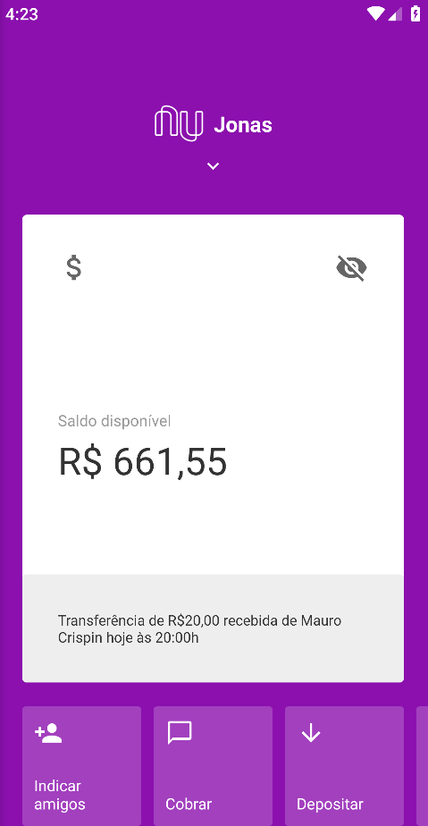

## Projeto React Native Nubank

### Para rodar o projeto:

1. Clonar o repositório e rodar o comando `yarn install` ou `npm install` dentro da pasta.
2. Rode `react-native run-android` ou `react-native run-ios` para iniciar o aplicativo.

### Screenshot

Obs: Certifique-se de ter configurado o SDK corretamente. Android 9 PIE